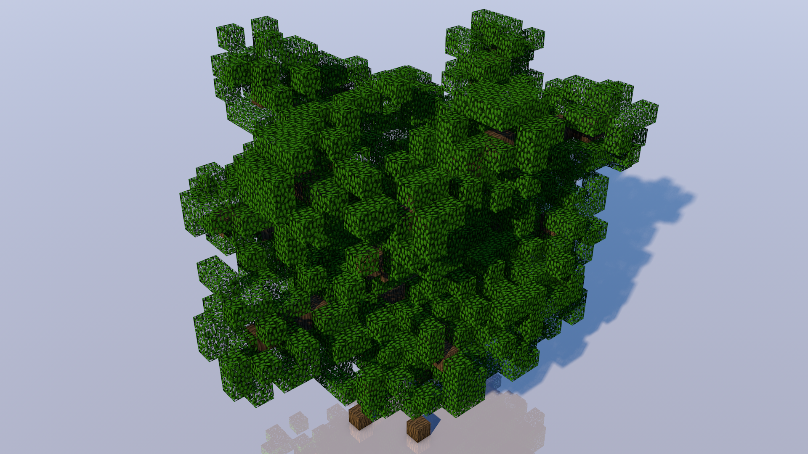
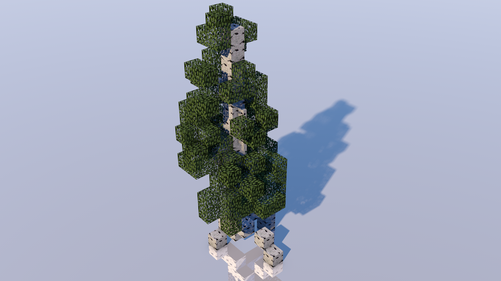
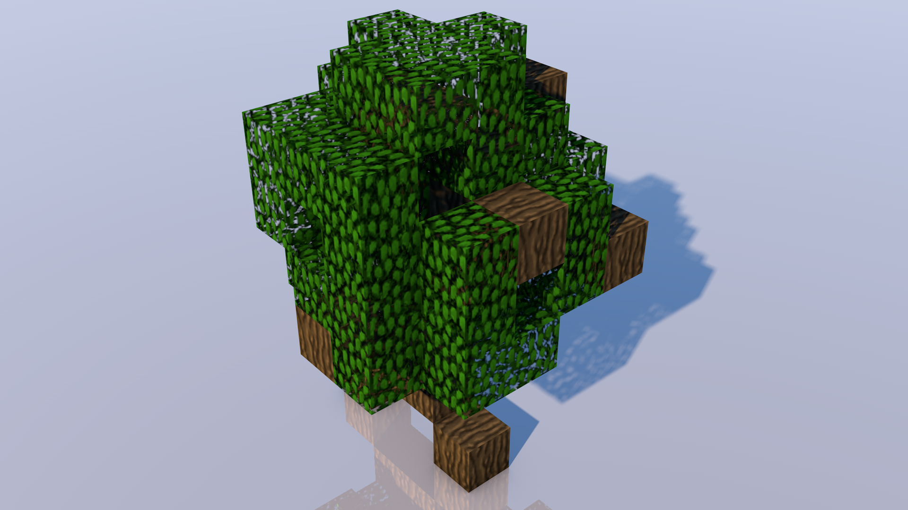

Betula pendula M2.png

Fraxinus excelsior M2.png

Alnus glutinosa L1.png

Betula pendula M1.png

Alnus glutinosa S1.png

Alnus glutinosa M2.png

Betula pendula S2.png

Alnus glutinosa L2.png

Fraxinus excelsior L1.png

Fraxinus excelsior L2.png

Betula pendula S1.png

Fraxinus excelsior S1.png

Alnus glutinosa M1.png

Fraxinus excelsior S2.png

Fraxinus excelsior M1.png

Alnus glutinosa S2.png

