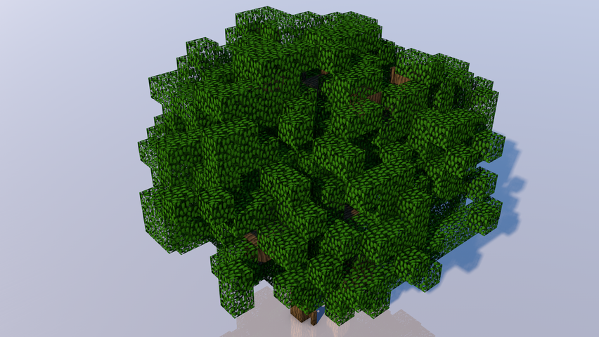
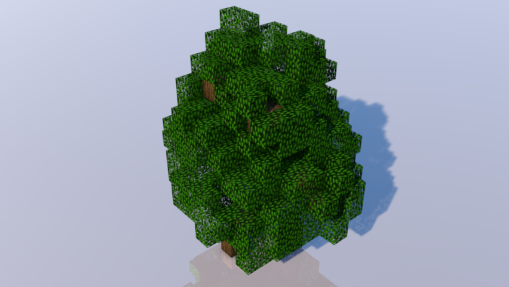

[Alnus glutinosa L1.schematic](Schematics/Alnus glutinosa L1.schematic)

[Alnus glutinosa L2.schematic](Schematics/Alnus glutinosa L2.schematic)

[Alnus glutinosa M1.schematic](Schematics/Alnus glutinosa M1.schematic)

[Alnus glutinosa M2.schematic](Schematics/Alnus glutinosa M2.schematic)

[Alnus glutinosa S1.schematic](Schematics/Alnus glutinosa S1.schematic)

[Alnus glutinosa S2.schematic](Schematics/Alnus glutinosa S2.schematic)

[Betula pendula M1.schematic](Schematics/Betula pendula M1.schematic)

[Betula pendula M2.schematic](Schematics/Betula pendula M2.schematic)

[Betula pendula S1.schematic](Schematics/Betula pendula S1.schematic)

[Betula pendula S2.schematic](Schematics/Betula pendula S2.schematic)

[Cornus sanguinea L1.schematic](Schematics/Cornus sanguinea L1.schematic)

[Cornus sanguinea L2.schematic](Schematics/Cornus sanguinea L2.schematic)

[Cornus sanguinea M1.schematic](Schematics/Cornus sanguinea M1.schematic)

[Cornus sanguinea M2.schematic](Schematics/Cornus sanguinea M2.schematic)

[Cornus sanguinea S1.schematic](Schematics/Cornus sanguinea S1.schematic)

[Cornus sanguinea S2.schematic](Schematics/Cornus sanguinea S2.schematic)

[Fraxinus excelsior L1.schematic](Schematics/Fraxinus excelsior L1.schematic)

[Fraxinus excelsior L2.schematic](Schematics/Fraxinus excelsior L2.schematic)

[Fraxinus excelsior M1.schematic](Schematics/Fraxinus excelsior M1.schematic)

[Fraxinus excelsior M2.schematic](Schematics/Fraxinus excelsior M2.schematic)

[Fraxinus excelsior S1.schematic](Schematics/Fraxinus excelsior S1.schematic)

[Fraxinus excelsior S2.schematic](Schematics/Fraxinus excelsior S2.schematic)

[Picea mariana L1.schematic](Schematics/Picea mariana L1.schematic)

[Picea mariana L2.schematic](Schematics/Picea mariana L2.schematic)

[Picea mariana M1.schematic](Schematics/Picea mariana M1.schematic)

[Picea mariana M2.schematic](Schematics/Picea mariana M2.schematic)

[Picea mariana S1.schematic](Schematics/Picea mariana S1.schematic)

[Picea mariana S2.schematic](Schematics/Picea mariana S2.schematic)

[Picea mariana XS1.schematic](Schematics/Picea mariana XS1.schematic)

[Picea mariana XS2.schematic](Schematics/Picea mariana XS2.schematic)

[Quercus petraea L1.schematic](Schematics/Quercus petraea L1.schematic)

[Quercus petraea L2.schematic](Schematics/Quercus petraea L2.schematic)

[Quercus petraea M1.schematic](Schematics/Quercus petraea M1.schematic)

[Quercus petraea M2.schematic](Schematics/Quercus petraea M2.schematic)

[Quercus petraea S1.schematic](Schematics/Quercus petraea S1.schematic)

[Quercus petraea S2.schematic](Schematics/Quercus petraea S2.schematic)

[Quercus robur L1.schematic](Schematics/Quercus robur L1.schematic)

[Quercus robur L2.schematic](Schematics/Quercus robur L2.schematic)

[Quercus robur M1.schematic](Schematics/Quercus robur M1.schematic)

[Quercus robur M2.schematic](Schematics/Quercus robur M2.schematic)

[Quercus robur S1.schematic](Schematics/Quercus robur S1.schematic)

[Quercus robur S2.schematic](Schematics/Quercus robur S2.schematic)

[Ulmus  minor subsp. minor L1.schematic](Schematics/Ulmus  minor subsp. minor L1.schematic)

[Ulmus  minor subsp. minor L2.schematic](Schematics/Ulmus  minor subsp. minor L2.schematic)

[Ulmus  minor subsp. minor M1.schematic](Schematics/Ulmus  minor subsp. minor M1.schematic)

[Ulmus  minor subsp. minor M2.schematic](Schematics/Ulmus  minor subsp. minor M2.schematic)

[Ulmus  minor subsp. minor S1.schematic](Schematics/Ulmus  minor subsp. minor S1.schematic)

[Ulmus  minor subsp. minor S2.schematic](Schematics/Ulmus  minor subsp. minor S2.schematic)

